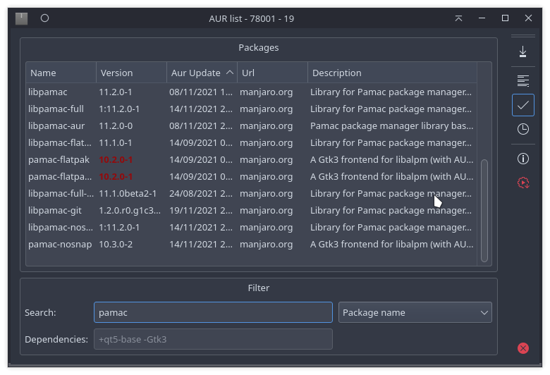

# Aurkonsult

**Aur Explorer - Qt Gui without rpc for plasma**

---

Aur proposes 2 databases. By default, Aurkonsult uses the simple.

 * simple : 7Mb to download
 * extended: 9Mb - we have in addition dependencies. add --ext option

Database in:

 * /tmp/ or
 * ~/.cache/packages-meta{-ext}-v1.json

---

drag&drop:

 - default : yay -Si
 - `ALT` : yay -S
 - `SHIFT` : url project